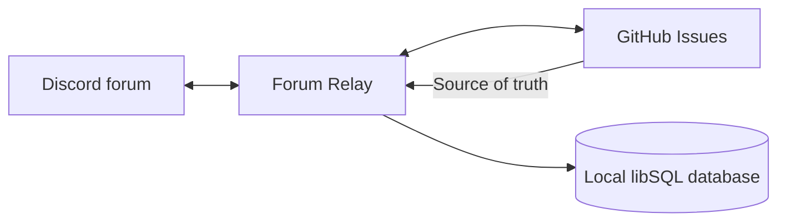

# Forum Relay

Forum Relay is a self-hosted Discord bot that synchronizes Discord forum channels and GitHub Issues in both directions.
GitHub Issues remain the source of truth while Discord users can create and discuss suggestions without needing GitHub
accounts.

AutoPlus.gg does not operate a shared bot or GitHub App. Every operator creates and privately hosts their own Discord
application, GitHub App, database, and deployment.

## Features

- Import an existing Discord forum into a repository or import GitHub Issues into an empty forum.
- Relay new threads, issues, messages, comments, edits, and deletions without notification loops.
- Synchronize issue labels with stable Discord forum-tag IDs, including Discord-only tag renames.
- Mirror issue titles, open/closed state, locks, duplicate reasons, and GitHub activity such as project status changes.
- Render GitHub Markdown with Discord Components V2 and proxy supported attachments in both directions.
- Recover from missed events through durable inbox/outbox processing, webhook redelivery, and reconciliation.
- Maintain local database backups and expose readiness/liveness health endpoints.



## Status

Forum Relay is used in production by AutoPlus.gg. The first public release is `0.1.0`; configuration and operational
compatibility may still change before `1.0.0`, with migration instructions provided in release notes.

## Requirements

- Bun 1.0 or newer. Node.js runtime compatibility is not a project goal.
- A private Discord application with the Message Content intent.
- A private GitHub App installed on the repositories being synchronized.
- A public HTTP or HTTPS endpoint that GitHub can reach for webhook delivery.
- A persistent directory for the libSQL database and its backups.

## Quick start

```sh
git clone https://github.com/autoplus-gg/forum-relay.git
cd forum-relay
bun install --frozen-lockfile
cp config/example.env config/.env
cp config/config.example.ts config/config.ts
bun run start
```

The credentials, permissions, webhook events, configuration fields, Docker setup, and initial bootstrap procedure are
documented in the [setup guide](docs/SETUP.md). Do not run a bootstrap before reviewing its preview.

## Privacy and security

Forum Relay copies content between platforms. Discord messages and user attribution can become visible to everyone who can
access the destination GitHub repository, while GitHub issue content can become visible to everyone who can access the
Discord forum.

Discord attachments relayed to GitHub are uploaded through `m.ticket.pm`. Those uploaded bytes are immutable and cannot be
deleted later, even when the original message is edited or removed. The database contains message relationships and
Discord webhook tokens in plaintext, so the configuration, database, and backups must all be treated as secrets.

Read the [security policy](SECURITY.md) and the setup guide's attachment disclosure before deploying the bot.

## Documentation

- [Setup and deployment](docs/SETUP.md)
- [Configuration reference](docs/CONFIGURATION.md)
- [Operations and recovery](docs/OPERATIONS.md)
- [Upgrading](docs/UPGRADING.md)
- [Functional specification](docs/SPECIFICATION.md)
- [Architecture](docs/ARCHITECTURE.md)
- [Support policy](SUPPORT.md)

## Development

```sh
bun install
bun run prepare:config
bun run check
bun run test:coverage
bun run build
```

See [CONTRIBUTING.md](CONTRIBUTING.md) before opening a pull request.

## License

Forum Relay is licensed under the [Apache License, Version 2.0](LICENSE).
