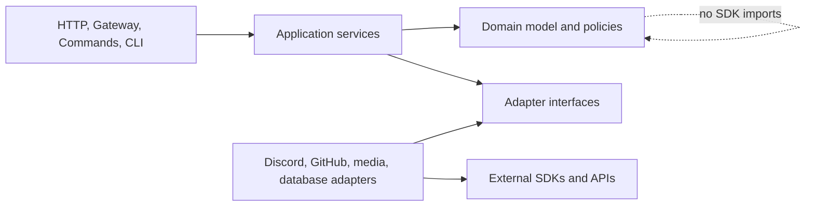
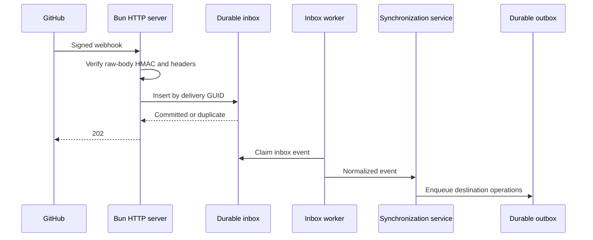
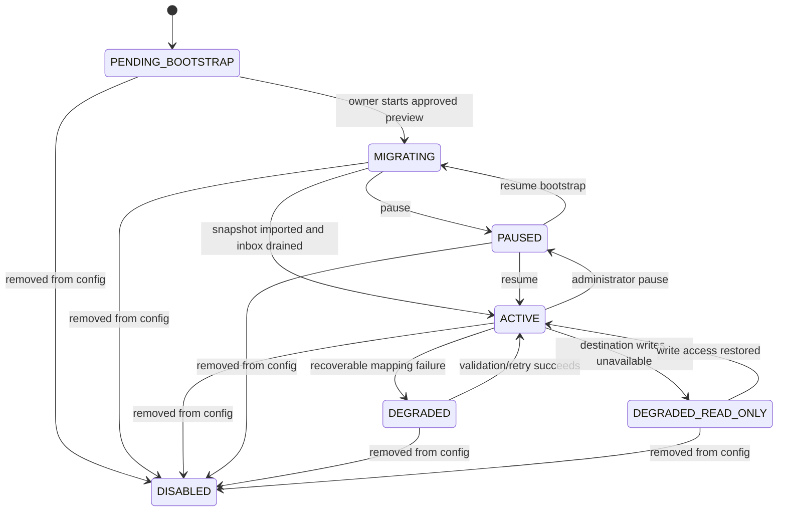

# Forum Relay Architecture

## 1. Architectural goals

Forum Relay must:

- Preserve content across temporary failures.
- Produce effectively-once results from at-least-once events.
- Keep GitHub canonical without overwriting independent GitHub edits.
- Recover from missed Gateway events, failed webhooks, crashes, and database loss.
- Isolate a failed mapping from healthy mappings.
- Keep platform SDK types outside the synchronization domain.
- Run on Bun without Node.js compatibility as a design constraint.

## 2. Technology choices

- **Runtime and HTTP:** Bun and `Bun.serve`
- **Discord:** `@discordjs/core`, `@discordjs/rest`, and `@discordjs/ws`
- **GitHub:** official Octokit packages behind a local adapter
- **Database:** Drizzle ORM with local SQLite or a libSQL-compatible URL
- **Discord attachment proxy:** `@ticketpm/core` and `m.ticket.pm`
- **Testing:** Vitest executed with `bun --bun vitest`
- **Formatting/linting:** Biome
- **Configuration:** versioned, strongly typed TypeScript

## 3. Module boundaries

```text
src/
├── app.ts
├── index.ts
├── cli/
│   ├── backup/
│   ├── config/
│   ├── mapping/
│   └── recovery/
├── config/
│   ├── index.ts
│   ├── normalize.ts
│   ├── validate.ts
│   └── versions/
├── core/
│   ├── custom-id.ts
│   ├── discovery.ts
│   ├── environment.ts
│   ├── logger.ts
│   ├── registry.ts
│   └── router.ts
├── db/
│   ├── migrations/
│   ├── repositories/
│   ├── schema.ts
│   └── transaction.ts
├── domain/
│   ├── attachments/
│   ├── bootstrap/
│   ├── content/
│   ├── lifecycle/
│   ├── mappings/
│   ├── reconciliation/
│   ├── relay-items/
│   └── synchronization/
├── adapters/
│   ├── discord/
│   ├── github/
│   ├── media/
│   └── storage/
├── events/
├── features/
│   └── relay/
├── http/
│   ├── health.ts
│   ├── server.ts
│   └── webhook.ts
├── jobs/
│   ├── inbox-worker.ts
│   ├── outbox-worker.ts
│   ├── scheduler.ts
│   └── worker-lease.ts
├── rendering/
│   ├── discord-to-github/
│   ├── github-to-discord/
│   └── shared/
└── types/
```

The exact folders may evolve, but dependency direction must remain:



The domain layer receives normalized records and discriminated events. It does not receive Discord or Octokit response objects.

## 4. Process startup

Startup proceeds in this order:

1. Load environment values and secret files.
2. Import and normalize the versioned TypeScript config.
3. Validate global configuration and reject placeholders.
4. Open the database.
5. Create a pre-migration backup for local SQLite.
6. Apply schema migrations transactionally.
7. Start the minimal HTTP liveness server.
8. Attempt to acquire the worker lease.
9. If the lease is acquired, initialize GitHub, Discord, and media adapters.
10. Discover commands, events, and features.
11. Validate each mapping independently.
12. Register Discord commands for the configured guild.
13. Connect the Gateway.
14. Start inbox/outbox workers and scheduled maintenance.
15. Mark readiness true when durable intake and worker processing are available.

A process that does not own the lease remains live but unready and never connects the Gateway.

## 5. Event ingestion

### 5.1 GitHub



The HTTP path performs no relay API calls.

### 5.2 Discord

Gateway message events use stable Discord IDs:

- Create: message ID
- Edit: message ID plus edited timestamp/revision hash
- Delete: message ID plus delete event kind
- Thread create/delete: thread ID

Thread state updates without a unique event ID use a fingerprint containing the thread ID, observed state, Gateway sequence context, and observed timestamp. Audit classification remains a separate durable job.

Gateway handlers persist normalized event payloads before scheduling work.

## 6. Inbox and outbox

### 6.1 Inbox

Inbox states:

- `pending`
- `processing`
- `processed`
- `retry_wait`
- `dead`
- `redacted`

Each inbox event stores:

- Platform and event kind
- Stable deduplication key
- Mapping/repository/forum locator
- Received timestamp
- Normalized payload
- Attempt count
- Next-attempt timestamp
- Last categorized error
- Correlation ID

Workers claim rows through short transactions with a lease expiry. A crashed worker leaves rows reclaimable.

### 6.2 Outbox

Outbox operations represent destination intent, not merely HTTP calls.

Examples:

- Create GitHub issue
- Edit GitHub comment revision
- Apply label IDs
- Create Discord forum thread
- Replace Discord message segments
- Archive and lock a thread
- Upload one Discord attachment

Outbox states mirror inbox processing states.

An operation has:

- Stable idempotency key
- Mapping and relay-item IDs
- Expected source revision
- Operation kind and typed payload
- Dependency operation IDs
- Attempt and scheduling fields
- Destination result IDs after success

Creates always persist the returned destination ID in the same transaction that marks the operation successful.

## 7. Idempotency

Example keys:

```text
inbox:github:{delivery-guid}
inbox:discord:message-create:{message-id}
inbox:discord:message-edit:{message-id}:{edited-timestamp}
outbox:{mapping-id}:{relay-item-id}:{source-revision}:render-discord
outbox:{mapping-id}:{issue-id}:{state-version}:apply-github-state
attachment:discord:{attachment-id}:{content-hash}
```

Idempotency is checked at three layers:

1. Unique database constraints.
2. Existing source/destination relationship records.
3. Re-fetching destination state before non-idempotent external creates when a prior result is uncertain.

No platform call is considered successful until its destination identity/state is durably recorded.

## 8. Operation ledger and loop suppression

Before changing either platform, Forum Relay records:

- Platform
- Resource ID
- Intended action and expected resulting state/hash
- Operation ID
- Creation and expiry timestamps

When the resulting webhook/Gateway event arrives:

- Match resource, action, state/hash, and time window.
- Attach the external event to the originating operation.
- Mark it self-generated.
- Do not create a reverse operation.

Ledger matching is evidence-based. Actor identity alone is insufficient because the GitHub App also represents genuine Discord-origin actions.

## 9. Ordering and concurrency

- A logical issue/thread is the ordering partition.
- Only one mutating operation per partition executes at a time.
- Separate mappings and issues may execute concurrently.
- Attachment jobs may run in parallel but their containing render waits only when required for a final revision.
- Pending edits coalesce to the newest source revision.
- Creates and deletes never coalesce away.
- State transitions may coalesce only before any transition has been externally delivered.

Global and per-adapter concurrency limits are adaptive to API rate-limit feedback.

## 10. Canonical revision model

Each relay item stores:

- Source platform/type/ID
- Destination platform/type/ID
- Source revision hash
- Last synchronized canonical hash
- Destination render hash and render version
- Author snapshot
- Created/edited/deleted timestamps
- Suppressed/tombstoned/minimized flags
- Optional revision-shadow relationship

Before Discord-origin content mutates GitHub:

1. Fetch current GitHub raw Markdown.
2. Parse the Forum Relay envelope/marker.
3. Compare the canonical content hash.
4. Apply only when the current GitHub revision matches the synchronized base.
5. Otherwise emit a conflict result and revision shadow.

The renderer is deterministic for the tuple:

```text
(normalized source, author snapshot, destination capabilities, render version)
```

## 11. Conceptual database model

The initial schema should include these concepts:

### Global

- `app_meta`
- `schema_migrations`
- `worker_leases`
- `maintenance_runs`
- `backup_records`

### Mapping state

- `mappings`
- `mapping_webhooks`
- `label_bindings`
- `bootstrap_jobs`
- `reconciliation_runs`
- `mapping_cursors`

### Relay relationships

- `issue_thread_links`
- `relay_items`
- `relay_segments`
- `revision_shadows`
- `attachment_links`

### Durable processing

- `inbox_events`
- `outbox_operations`
- `operation_dependencies`
- `operation_ledger`
- `audit_classification_jobs`

Important constraints:

- Mapping key unique.
- GitHub repository ID unique across active mappings.
- Discord forum ID unique across active mappings.
- GitHub issue ID unique within a mapping.
- Discord thread ID unique within a mapping.
- Source platform/type/ID unique for relay items.
- Destination Discord message ID unique for segments.
- Inbox and outbox idempotency keys unique.
- GitHub label and Discord tag IDs unique within a mapping.

Foreign keys use restrictive deletion by default. Mapping cleanup is an explicit service, not cascading table deletion.

## 12. Mapping state machine



Removing and later restoring the same immutable mapping key reactivates its stored identity after validation; it does not bootstrap again.

## 13. Relay-item state

Relay items distinguish source lifecycle from mirror lifecycle.

Source lifecycle:

- `present`
- `edited`
- `deleted`
- `source_deleted`
- `transferred`

Mirror lifecycle:

- `pending`
- `current`
- `stale`
- `suppressed`
- `missing`
- `tombstoned`
- `failed`

This separation prevents destination deletion from being mistaken for source deletion.

## 14. Bootstrap architecture

Bootstrap has:

- Immutable approved preview snapshot
- Source enumeration cursor
- Import queue
- Per-item progress
- Live-event high-water mark
- State-application phase
- Inbox-drain phase

The preview contains a digest of relevant config and source/target inventory. Start fails if the digest no longer matches; the owner must preview again.

The import never assumes an API page is stable:

- Enumerate oldest-first with stored cursors.
- Store source IDs before destination creation.
- Re-fetch each source item before final state.
- Deduplicate live events against imported revisions.

## 15. Discord adapter

Responsibilities:

- Gateway lifecycle and normalized event emission
- Forum/thread/message REST operations
- Audit-log retrieval and delayed correlation
- Guild/channel/member/permission resolution
- Application command registration
- Dedicated webhook creation/execution/edit/delete
- Components V2 capability and upload-limit resolution

The adapter always sets non-notifying allowed mentions on webhook sends and edits.

It must not expose raw REST/Gateway payload types to the domain.

## 16. GitHub adapter

Responsibilities:

- App JWT creation
- Installation lookup and token caching
- Typed webhook verification and normalization
- REST/GraphQL issue, comment, label, state, lock, and timeline operations
- Resolution of organization Project item webhooks to existing issue/thread links by GitHub node ID
- Repository identity and access validation
- Failed App-webhook delivery inspection/redelivery
- Private content/attachment fetch authorization
- Pagination and rate-limit classification

Installation tokens are short-lived and memory-only. Cache expiry accounts for clock skew.

The adapter filters Pull Requests from issue enumeration.

## 17. Rendering architecture

### 17.1 GitHub to Discord

Pipeline:

```text
raw GitHub Markdown
→ GFM AST
→ sanitize/resolve repository context
→ normalized render document
→ Components V2 block stream
→ limit-aware Discord segments
→ webhook payloads and files
```

A normalized render document uses internal nodes such as:

- Text block
- Code block
- Quote/alert
- List
- Table
- Media
- File
- Separator
- Source link

GitHub HTML is parsed only to extract approved semantic content such as `` and `<details>`. It is never passed through directly.

### 17.2 Discord to GitHub

Pipeline:

```text
Discord message and resolved entities
→ Discord-aware tokenization
→ safe cross-platform Markdown
→ fixed attribution envelope
→ attachment placeholders/links
→ relay marker
```

Discord entity parsing is code-aware so mention-like text inside code is not rewritten.

## 18. Attachment architecture

### Discord to GitHub

- Persist attachment metadata.
- Create the GitHub item with placeholders.
- Submit Discord CDN URLs through one long-lived `m.ticket.pm` client, anonymously by default or with an optional token.
- Persist returned hashes and durable URLs.
- Schedule a containing-item revision.

### GitHub to Discord

- Classify URL before fetching.
- Resolve repository-relative URLs.
- Allow HTTPS only.
- Resolve DNS and reject loopback, link-local, private, reserved, and metadata ranges.
- Revalidate every redirect.
- Stream with strict byte/time limits.
- Verify MIME using headers and content sniffing.
- Upload within the current Discord limit or fall back to a link.

Partial files and temporary buffers are removed after success/failure.

## 19. Audit classification

A thread update classification job stores:

- Thread ID
- Previous and observed archived/locked state
- Gateway event timestamp/sequence
- Nearby human message IDs
- Matching operation-ledger candidates
- Audit-log queries and results
- Final classification and confidence

Classification outcomes:

- `self_operation`
- `manual_close`
- `manual_reopen`
- `manual_lock`
- `manual_unlock`
- `inactivity_archive`
- `message_reopen`
- `ambiguous`

Ambiguous outcomes never mutate GitHub and are retried by targeted reconciliation.

## 20. Reconciliation

Reconciliation uses compare/plan/apply:

1. Read stored relationship and hashes.
2. Fetch canonical GitHub state.
3. Fetch Discord thread/message state.
4. Produce typed discrepancies.
5. Remove discrepancies explained by pending operations or suppression.
6. Write a reconciliation plan.
7. Apply through the normal outbox.
8. Persist results.

Administrator preview exposes the plan before a manual full apply.

Automatic reconciliation may safely repair:

- Missing current webhook segments not intentionally suppressed
- Stale title, state, lock, or mapped tags
- Unprocessed GitHub delivery redeliveries
- Missing recorded destination IDs discoverable with high confidence

It does not automatically recreate deleted threads or suppressed logical items.

## 21. Failed GitHub webhook delivery recovery

GitHub App webhook delivery logs are checked:

- At startup
- Every five minutes by default

For each failed delivery in GitHub's redelivery window:

- Ignore delivery GUIDs already processed successfully.
- Request redelivery through the GitHub App API.
- Record the request and response.
- Allow the normal webhook endpoint to deduplicate and process it.
- Escalate repeatedly failing delivery IDs to operational logs.

This job inspects delivery status; it does not poll issue content.

## 22. Worker lease

The lease row contains:

- Stable process instance ID
- Acquired/renewed timestamps
- Expiry timestamp
- Host diagnostic label

Rules:

- Acquire with a compare-and-swap transaction.
- Renew well before expiry.
- Stop claiming jobs immediately when renewal fails.
- Disconnect the Gateway and mark readiness false before lease expiry where possible.
- Never “steal” an unexpired lease based on local clock assumptions.

All scheduling uses a clock abstraction and database timestamps suitable for deterministic tests.

## 23. Backups and recovery

For local SQLite:

- Use a database-consistent backup mechanism, not a raw copy during writes.
- Create a pre-migration backup before applying schema changes.
- Run one daily backup while the worker lease is held.
- Prune only backups exceeding the configured retained count.
- Verify that a backup opens and reports the expected schema version before considering it successful.

Recovery scan confidence:

- **Exact:** Signed/structured GitHub marker plus matching Discord ID.
- **Strong:** Canonical GitHub jump URL in a bot-owned webhook message plus matching repository/thread context.
- **Ambiguous:** Title/time/author similarity only.

Only exact/strong matches are eligible for automatic apply. Ambiguous candidates require operator review and explicit pairing support outside v1.

## 24. Health semantics

`/health/live` succeeds when the HTTP process can answer requests.

`/health/ready` succeeds when:

- Database is reachable and migrated.
- This process owns the worker lease.
- Durable inbox persistence is available.
- GitHub App global authentication is valid.
- Discord Gateway is ready.
- Workers are running.

Individual degraded mappings do not make global readiness fail. Readiness responses expose a boolean/status code, not mapping names or secrets.

## 25. Security boundaries

### Secrets

- Environment or secret-file loading only.
- Reject simultaneous direct and `_FILE` variants.
- Reject example placeholders.
- Never render secrets in config errors.
- GitHub installation tokens remain in memory.
- Discord webhook tokens are plaintext database secrets by explicit project policy.

### HTTP

- Production requires an HTTPS reverse proxy.
- Do not use source IP as webhook authentication.
- Verify GitHub signatures before JSON parsing.
- Apply body, header, request-time, and concurrency limits.
- Health endpoints contain no diagnostics.

### Content

- Disable cross-platform mentions.
- Sanitize raw HTML and unsafe URL schemes.
- Prevent relay-marker injection.
- Enforce SSRF protections on GitHub attachment downloads.
- Escape usernames, display names, filenames, lifecycle reasons, and labels at their output boundary.

### Authorization

- Re-check the actor's current permissions when executing delayed command operations.
- Never rely solely on a UI control having been shown.
- Audit native Discord thread mutations where an actor is needed.

### Private repositories

Bootstrap preview and startup logs warn that private GitHub issue content is intentionally disclosed to members who can access the mapped Discord forum.

## 26. Logging

Use structured records internally, with readable stdout output.

Fields include:

- Timestamp and level
- Subsystem
- Mapping key
- Correlation/operation ID
- Source and destination resource IDs
- Event/operation kind
- Attempt count and categorized error
- Actor ID when available

Message bodies, webhook tokens, App keys, signed media URLs, and authorization headers are forbidden log fields.

No third-party log transport is built into Forum Relay.

## 27. Testing architecture

External systems are ports:

- `DiscordGatewayPort`
- `DiscordApiPort`
- `GitHubAppPort`
- `MediaProxyPort`
- `Clock`
- `IdGenerator`
- `Database`

Domain tests use deterministic in-memory/fake implementations. Database tests use isolated SQLite files or in-memory libSQL where supported.

Fixture boundaries validate:

- GitHub webhook payload to normalized domain event
- Discord Gateway/REST payload to normalized domain event
- Domain operation to exact adapter request

Vitest fake timers drive backoff, lease expiry, audit delay, and maintenance schedules.

The 90% domain threshold applies to:

- State transitions
- Conflict policy
- Bootstrap planning
- Rendering normalization/segmentation
- Mention conversion
- Reconciliation planning
- Inbox/outbox/idempotency policy

## 28. TypeScript rules

- Do not use `any` or `unknown`.
- Represent uncertain JSON with explicit recursive JSON value types.
- Validate and narrow at platform boundaries.
- Prefer discriminated unions for events, operations, states, errors, and plans.
- Do not cast through `never` or another type to silence incompatibilities.
- Comments explain non-obvious invariants, races, and platform mismatches rather than restating code.
